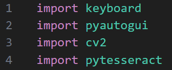
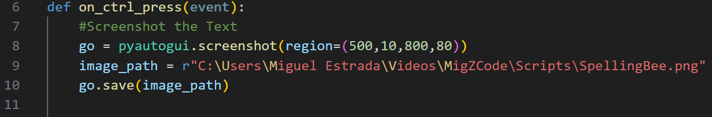
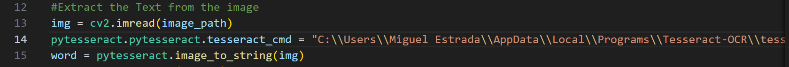
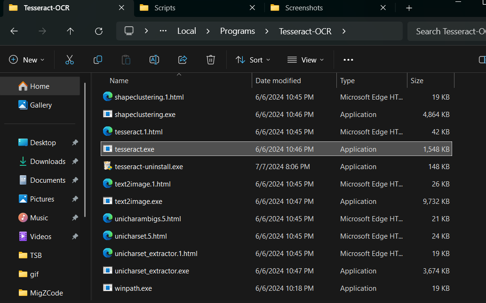
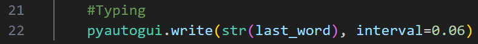
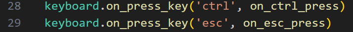

# PySpellingBee
An easy external way to cheat in Roblox Spelling Bee

How I made the Code Video: https://www.youtube.com/watch?v=Ozj91RWB9qk
 
 
### How to Set Up and Run the Code:

1. Import and Download required Module's for the Script

   

2. On Line 9, change the image path to your desired location

   

3. On Line 14, update the file path to your where your "tesseract.exe" path location is

   
   

4. Lastly, on Line 22, you may adjust typing speed to your liking

   
 
 

### Controls/Key Bindings:

You may change the key bindings if you like; the default key bindings are:

*Ctrl* to Run the Code
*Esc* to Stop the Code
